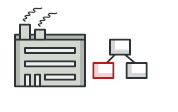
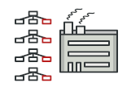
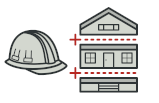
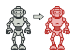
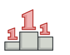

# Creational Design Patterns 
Creational patterns cung cấp các cơ chế tạo đối tượng khác nhau, giúp tăng tính linh hoạt và khả năng tái sử dụng code hiện có. 

## Factory method 

Cung cấp một interface cho đối tượng tạo ở lớp cha, nhưng cho phép lớp con thay đổi kiểu đối tượng được tạo. 

## Abstract Factory method 

Hỗ trợ cho việc tạo các đối tượng có liên quan với nhau trong một nhóm, không cần chỉ định đến lớp cụ thể. 

## Builder method 

Xây dựng các đối tượng phức tạp theo từng bước. Pattern này hỗ trợ việc tạo và biểu diễn các đối tượng khác nhau bằng code khởi tạo giống nhau. 

## Prototype 

Giúp sao chép các đối tượng mà code sẽ không phụ thuộc vào class của đối tượng đó. 

## Singleton 

Đảm bảo rằng một class chỉ có một đối tượng duy nhất, trong khi cung cấp điểm truy cập toàn cục cho thực thể đó. 

