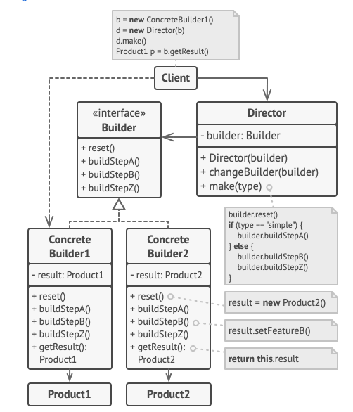

# Creational Design Patterns 
Creational patterns cung cấp các cơ chế tạo đối tượng khác nhau, giúp tăng tính linh hoạt và khả năng tái sử dụng code hiện có. 

## Factory method 

Cung cấp một interface cho đối tượng tạo ở lớp cha, nhưng cho phép lớp con thay đổi kiểu đối tượng được tạo. 

### Ứng dụng: 
1. Sử dụng phương thức Factory khi bạn không biết chính xác kiểu và phụ thuộc của đối tượng mà code bạn sẽ làm việc 

2. Sử dụng khi ban muốn cung cấp cho người dùng thư viện hay framework với cách mở rộng các thành phần trong nó.

3. Sử dụng khi bạn muốn tiết kiệm tài nguyên hiện có thay vì tạo mới chúng mỗi lần. 

## Abstract Factory method 

Hỗ trợ cho việc tạo các đối tượng có liên quan với nhau trong một nhóm, không cần chỉ định đến lớp cụ thể. 

### Ứng dụng: 
1. Sử dụng Abstract Factory khi bạn cần làm việc với nhiều biến thể của một nhóm sản phẩm mà bạn không muốn phụ thuộc vào lớp cụ thể của sản phẩm đó - chúng có thể chưa biết hoặc đơn gian là bạn muốn mở rộng cho tương lai. 

## Builder method 

Xây dựng các đối tượng phức tạp theo từng bước. Pattern này hỗ trợ việc tạo và biểu diễn các đối tượng khác nhau bằng code khởi tạo giống nhau. 

### Cấu trúc: 

* **Builder:** interface khai báo các bước tạo sản phẩm chung cho tất cả loại builder. 
* **Concrete Builder:** cung cáp các triển khai khác nhau cho các bước khởi tạo 
* **Product:** đối tượng kết quả. 
* **Director:** lớp định nghĩa thứ tự gọi các bước khởi tạo. 
* **Client:** liên kết đến một trong các đối tượng builder và director. 

### Ứng dụng: 
1. Sử dụng Builder để loại bỏ các "hàm khởi tạo khổng lồ"
2. Sử dụng Builder khi bạn muốn code của bạn tạo ra các sản phẩm có biểu diễn khác nhau (như bóng nhựa, bóng tennis, bóng đá,...)
3. **Sử dụng Builder để tạo ra những cây Composite và các đối tượng phức tạp khác.** 

    Vì builder xây dựng sản phẩm theo từng bước một, nên ta có thể trì hoãn việc thực thi một số bước mà không làm ảnh hưởng đến sản phẩm cuối cùng. 

## Prototype 

Giúp sao chép các đối tượng mà code sẽ không phụ thuộc vào class của đối tượng đó. 

### Ứng dụng: 
1. Sử dụng Prototype khi code bạn không muốn phụ thuộc vào lớp cụ thể của đối tượng cần sao chép. 
2. Sử dụng Prototype khi bạn muốn giảm số lượng lớp con, chỉ khác nhau về cách chúng được khởi tạo các đối tượng tương ứng. 

## Singleton 

Đảm bảo rằng một class chỉ có một đối tượng duy nhất, trong khi cung cấp điểm truy cập toàn cục cho thực thể đó. 

